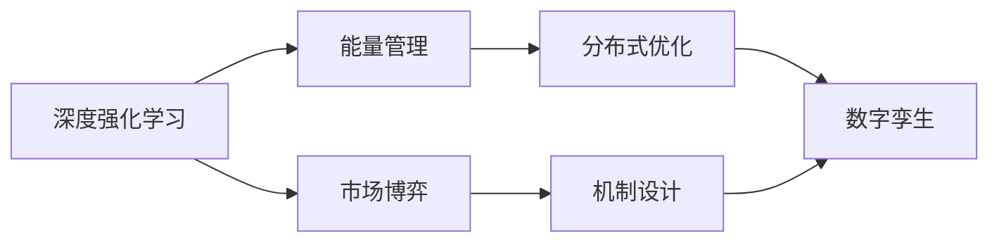

> 🔍 专注深度强化学习的研究者 | 微电网能量管理专家 | 致力于通过AI提升能源系统效率与安全性

## 🧠 研究方向
### ⚡ 多微电网智能调度
- 开发基于深度强化学习的分布式能量管理系统
- 突破传统优化算法的时间复杂度限制
- 构建具备容错能力的鲁棒控制框架

### 🤖 智能体技术创新
- 研究迁移学习在跨微电网场景的应用
- 设计基于数字孪生的仿真训练环境
- 探索多智能体协同优化策略

## 🌐 开源贡献

## 📬 联系与合作

- 产学研项目对接
- 学术论文合作
- 技术方案咨询

## 📚 近期关注

> 🌟 诚邀学术界和工业界的合作伙伴，共同推进智能电网技术革新！
